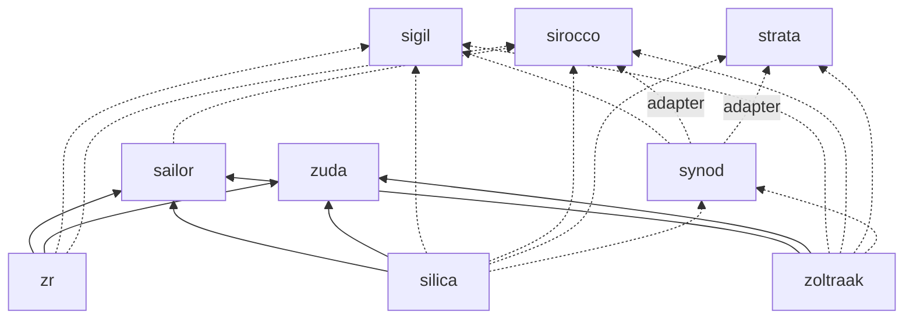

# The Zig Kingdom — Map

> 아홉 개의 레포, 네 개의 층. 아래층은 위층을 모른다.

```
┌──────────────────────────────────────────────────────────────────────┐
│  SERVICES         silica (RDBMS, PG wire)     zoltraak (Redis-compat) │
├──────────────────────────────────────────────────────────────────────┤
│  TOOLING          zr (task runner · toolchains · monorepo · MCP/LSP)  │
├──────────────────────────────────────────────────────────────────────┤
│  LIBRARIES        sailor (TUI/CLI)            zuda (DS/algos/scicomp) │
├──────────────────────────────────────────────────────────────────────┤
│  FOUNDATION       sigil      sirocco      strata      synod           │
│                   (formats)  (net/async) (storage)   (consensus)      │
└──────────────────────────────────────────────────────────────────────┘
                   ▲ Zig std only — no kingdom dependencies ▲
```

## Components

| Repo | Layer | One line | Status |
|---|---|---|---|
| [sigil](https://github.com/yusa-imit/sigil) | Foundation | Value IR + comptime reflection; JSON/TOML/YAML/MessagePack/CBOR/Protobuf/CSV; layered config | Bootstrap |
| [sirocco](https://github.com/yusa-imit/sirocco) | Foundation | Production `std.Io.VTable` implementation (kqueue/epoll/io_uring), powering std net/http/tls | Bootstrap — PRD to be rewritten for std.Io |
| [strata](https://github.com/yusa-imit/strata) | Foundation | File I/O abstraction, pages + buffer pool, segmented WAL + recovery, B+Tree, LSM, KV engine, snapshots | Bootstrap |
| [synod](https://github.com/yusa-imit/synod) | Foundation | Pure-state-machine Raft, joint consensus, SWIM, φ-accrual, HLC, deterministic simulator | Bootstrap |
| [zuda](https://github.com/yusa-imit/zuda) | Library | ~60 containers, 24 algorithm families, 209 distributions, NDArray/linalg/stats/FFT/optimize, ML (461k LOC) | v2.3.0 (+95 unreleased commits) |
| [sailor](https://github.com/yusa-imit/sailor) | Library | TUI framework, 140 widgets, CLI toolkit (150k LOC) | v2.99.0 |
| [zr](https://github.com/yusa-imit/zr) | Tooling | Task runner + toolchain manager + monorepo + MCP/LSP server (112k LOC) | v1.114.0 |
| [silica](https://github.com/yusa-imit/silica) | Service | Embedded/server RDBMS, SQL:2016, MVCC, PG wire, replication (184k LOC) | v1.0.1 |
| [zoltraak](https://github.com/yusa-imit/zoltraak) | Service | Redis-compatible store, 500+ commands, RESP2/3, cluster, Lua (141k LOC) | 0.2.0 in zon (0.2.13 claimed) |

## Dependency graph



Solid = dependency that exists today in `build.zig.zon`. Dotted = planned (see `ROADMAP.md`).

## Rules of the realm

1. **Foundation repos depend on Zig std only.** Kingdom integrations live in `src/adapters/` and are opt-in.
2. **Dependencies point down.** A library never imports a service; a foundation never imports a library.
3. **One version of each dependency across the kingdom.** `zr-repos.toml` `[deps]` is the reference; pin the same tag in every `build.zig.zon` (today zr pins zuda 2.0.4 while silica pins 2.3.0 — fix in ROADMAP Phase 0).
4. **Every repo has the same shape.** Code, `docs/` (`PRD.md`, `plans/`, `adr/`, `guides/`), `.github/`. No `CLAUDE.md`, no `.claude/` — the brain is `citadel/core/KINGDOM.md`, loaded through `/Users/fn/codespace/CLAUDE.md`. Policy: `protocol/DOCS.md`.
5. **Every repo is driven the same way.** A cron job (`workflows/jobs.toml`) runs `claude -p "/cycle <repo>"` in the repo with citadel attached (`--add-dir`). Plans are approved by merging PRs; see `protocol/GITHUB.md`.
6. **Zig 0.16.0 everywhere.** Realms still on 0.15.2 migrate under plan `001` (`docs/ROADMAP.md`); consumers wait for zuda/sailor v3.0.0.

## Names

| Name | Why |
|---|---|
| sigil | 의미를 새긴 기호 — 바이트에 의미를 새기는 직렬화 |
| sirocco | 함대를 밀어주는 바람 — sailor의 배를 움직이는 네트워크 |
| strata | 지층 — silica(광물) 아래 켜켜이 쌓인 저장 계층 |
| synod | 회의 — 노드들이 모여 합의에 이르는 곳 |
| citadel | 성채 — 왕국의 지휘소 |
